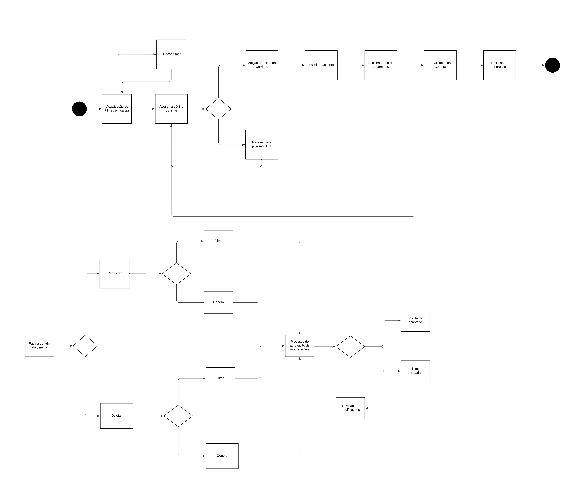

# Cinema-fds

Página no github dedicada a o projeto de Fundamentos de Desenvolvimento de Software

Grupo formado por 
- Júlia Sales
- Luiz Claudio
- Adriano Bernard
- Christian Bernard
- Matheus Cazé

# Entregas

### PRIMEIRA ENTREGA

 

[Página no Jira](https://juliasales.atlassian.net/jira/software/projects/PCF/boards/2)

[Protótipo Lo-Fi](https://www.figma.com/file/Ms5aUXSnImGqW7S97h7m92/Wireframe-Template-(Community)?type=design&node-id=0%3A1&mode=design&t=v2NZ8sR463NZwdIk-1)

[Screencast](https://www.youtube.com/watch?v=KBGdFhLl5QU) (abrir com o email institucional)

Backlog

Quadro

 
 
### SEGUNDA ENTREGA
 

### SITE
[Deployment na Azure](https://cinemafds.azurewebsites.net)

#### Instruções de uso:
- Bara usar o código é necessário adicionar todos os arquivos do requirements.txt na sua maquina
- Depois disso, é preciso rodar o comando -python manage.py runserver-
- Para alterações de admin, é necessário colocar /admin/ após o endereço do site
- Depois é necessária a criação de um superuser e logar na página de admin, possibilitando assim alterações dos filmes disponíveis e de suas respectivas categorias

[Diagrama atividades do sistema](https://lucid.app/lucidchart/bb251b89-9408-4094-92cf-37d2f4fcab6e/edit?viewport_loc=-10415%2C-6050%2C12296%2C4880%2C0_0&invitationId=inv_963f026a-c0bd-4bdf-bbd2-693fe5ce399d)

Bug Tracker

Sprint e histórias implementadas

[Screencast segunda entrega](https://youtu.be/Rphdc2gDhM0) 

- Programação em par não foi utilizado nessa entrega pois houve conflitos de horario entre os estudantes,além de um certo desconhecimento de como usar as ferramentas requeridas. 

### TERCEIRA ENTREGA

-Programação em par:

Durante o desenvolvimento da aplicação CineFds realizamos o Pair Programming, uma prática ágil onde dois desenvolvedores trabalham em conjunto no mesmo código utilizando do mesmo computador, seja de forma síncrona, ou assíncrona, com o objetivo de melhorar a qualidade do código, acelerar o desenvolvimento e adquirir conhecimento

Na entrega 2 não foi possivel aplicar esse método, porem na entrega 3  quase todo o desenvolvimento de código foi feito desta forma. Assim, seguimos o modelo de "piloto" e "navegador", alternando papéis regularmente para ter a garantia de que ambos estavam aprendendo e participando.

De começo não entendiamos a necessidade desse método, pois achávamos que tomaria muito do nosso tempo, mas depois de algumas tentativas percebemos que a colaboração direta resultava em um código mais limpo, com menos erros e com ideias mais criativas.

Na entrega 3, a colaboração conjunta doi crucial para o desenvolvimento das historias, principalmente a de "adicionar filmes" pois proporcionou um maior fluxo de soluções possiveis. Além disso, uma das maiores vantagens encontradas foi a redução na quantidade de bugs, pois haviam duas pessoas analisando o código, e por consequência é mais facil encontrar os possíveis erros, ajudando na manutenção do código.

Nosso maior desafio foi ter foco, principalmente para desenvolver as histórias, pois a vezes é fácil se perder com os diversos requisitos que o projeto exige, mas no final foi possivel obter um bom andamento

No final, ao contrário do que nós pensamos anteriormente, o Pair Programming se provou um método eficiente de trabalho, melhorando a qualidade do código e até fortalecendo laços entre as partes envolvidas, se tornando assim uma experiência de aprendizado que vale a pena ser vivida.

= Segundo Diagrama corrigindo o primeiro entregue =

= Sprint e histórias implementadas =

= Bug tracker  =

